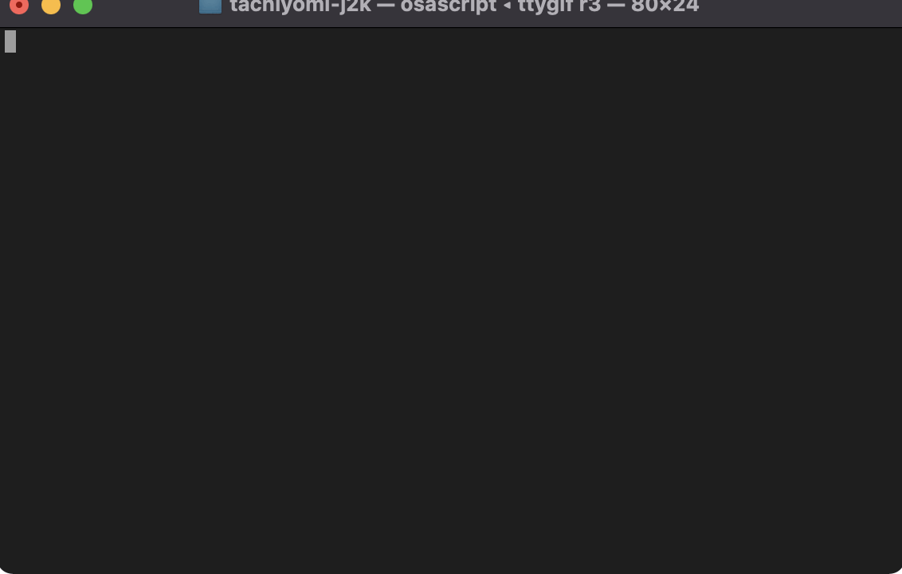

# L10n Monster

Do you want to set up continuous localization for your project but don't have a whole team to look after it? Do you know how `git` works? Have you set up a build like `webpack` before? You've come to the right place and you'll feel right at home!

L10n Monster is a tool to push source content out to translation vendors and to pull translations back in. No more no less.
It doesn't try to tell you how to consume content or deliver it to production. It doesn't deal with formatting and other internationalization concerns. There are a plenty of libraries to do that already, and some of them are really good.
It also, doesn't expect you and your friends to translate content yourself. There are plenty of agencies and professionals that do this for a living, you should use them!

## Getting started

### Installation

```sh
git clone git@github.com:l10nmonster/l10nmonster.git
cd l10nmonster
npm i
npm link
```

Eventually there will be a binary for each platform, but this is still under heavy development.

## Basic Operation

```sh
l10n push
```
It will re-read all your source content, figure out what needs translation, and send it to your translator.

```sh
l10n status
```
It will give you an overview of the state of translation of your project.

```sh
l10n analyze
```
It will analyze your sources and report insights like repeated content in different files and keys.

```sh
l10n grandfather -q 80
```
For all missing translations, it will extract translations from the current translated files and, if present, import them at the specified quality level. This assume translations are faithful translations of the current source (i.e. they didn't become outdated if the source has changed). This is probably only used at the beginning, in order to establish a baseline. Afterwards, translated files are always recreated from the TM and overwritten.

```sh
l10n leverage -q 70 -u 60
```
For all missing translations, it will look into the TM for translations of the exact same source text but in different resources, while matching or not the string id (called respectively qualified and unqualified repetition). Since reusing translations may lead to a loss of quality, you can choose what quality levels to assign to your specific content. Leveraging can be done on a regular basis before pushing content to translation, or never if it's not safe to do so.

```sh
l10n pull
```
If there are pending translations, it will check if they became available and it will fetch them.

```sh
l10n translate
```
It will generate translated files based on the latest sources and translations in the TM.

### Working files

L10n Monster maintains its working files in a hidden `.l10nmonster` directory at the root of the project. Working files are source-control friendly (json files with newlines) and can be checked in. On the other hand, they can also be destroyed and recreated on the fly if all you want to preserve is translations in your current files.

## Demo



## Basic Configuration

At the root of your project there should be a file named `l10nmonster.mjs`. You can create it by hand, or you can use `l10n init` and use one of the configurators to get up and running in no time. Well, that's the plan, it's not implemented yet!

The configuration must export a default class that once instantiated provides the following properties:

* `sourceLang`: the default source language
* `targetLangs`: a array of languages to translate to 
* `minimumQuality`: this is the minimum required quality for a string to be considered translated (anything below  triggers a request to translate)
* `source`: a source adapter to read input resources from
* `resourceFilter`: a filter to process the specific resource format
* `translationProvider`: a connector to the translation vendor
* `target`: a target adapter to write translated resources to
* `adapters`, `filters`, `translators`: built-in helpers (see below)

### FS Source Adapter

```js
this.source = new adapters.FsSource({
    globs: [ '**/values/strings.xml' ],
    filter: (resourceId) => (resourceId.indexOf('dont_translate.properties') === -1),
});
```

An adapter that reads sources from the filesystem. The `globs` array can specify wildcard patterns relative to the base directory where the `l10nmonster.mjs` is placed. The `filter` function can further filter out what's returned by the glob patterns.

### FS Target Adapter

```js
this.target = new adapters.FsTarget({
    targetPath: (lang, resourceId) => resourceId.replace('values', `values-${lang}`),
});
```

An adapter that writes translated resources to the filesystem. It takes in the object constructor a `targetPath` function that given a language and the resource id of the source, it produces the target resource id.


###  Java Properties Filter

```js
this.resourceFilter = new filters.JavaPropertiesFilter();
```

A filter for properties files used as defined by the Java bundle specification.

* [TODO] it needs configuration to deal with message formats.
* [TODO] it needs an option to make it stricter to deal with technically invalid files.

### iOS Strings Filter

```js
this.resourceFilter = new filters.IosStringsFilter();
```

A filter for strings files used in iOS apps.

* [TODO] it needs configuration to deal with message formats.
* [LIMIT] it doesn't support files encoded in UTF-16.

### Android XML Filter

```js
this.resourceFilter = new filters.AndroidFilter({
    comment: 'pre',
});
```

A filter for XML files used in Android apps. The `comment` property specifies whether developer notes are placed before, after, or on the same line (`pre`, `post`, `right` respectively).

* [TODO] it needs configuration to deal with message formats.
* [BUG] it doesn't honor the `translatable` attribute.

### PO Filter

```js
this.resourceFilter = new filters.PoFilter();
```

A filter for PO files.

* [TODO] it needs configuration to deal with message formats.

### Pig Latinizer Translator

```js
this.translationProvider = new translators.PigLatinizer({
    quality: 1
});
```

This is a pseudo-localization helper that converts source into [Pig Latin](https://en.wikipedia.org/wiki/Pig_Latin) to provide visual testing of hard-coded strings, concatenation, and text expansion. By default, quality is set to `1` but it can be overwritten in the constructor by passing the `quality` property.

### XLIFF Translator

```js
this.translationProvider = new translators.XliffBridge({
    requestPath: (lang, prjId) => `xliff/outbox/prj${prjId)}-${lang}.xml`,
    completePath: (lang, prjId) => `xliff/inbox/prj${(prjId)}-${lang}.xml`,
    quality: 80,
});
```

XLIFF is the industry standard for translation exchange. The adapter writes translation requests as XLIFF files that can be manually given to a translation vendor. Once translations are received, the corresponding translated files can be imported and saved.
There are no standard naming conventions for xliff files, so any can be implemented by providing 2 functions in the `requestPath` and `completePath` properties. The functions are given the target language and the project id as parameters from which to form a naming convention. By default, quality is set to `50` but it should be specified by passing the `quality` property.

## Advanced CLI

The CLI support additional options to control its behavior:

* `-a, --arg <string>`: this is a user-defined argument that allows to customize the user config behavior
* `-b, --build <type>`: a string indicating a build type (e.g. qa or production)
* `-r, --release <num>`: a string indicating a version number
* `-v, --verbose`: output additional debug information

Some commands also allow additional options. For more information type `l10n help <command>`.

## Advanced Configuration

There is also additional functionality in the configuration that can be useful, especially in environments with larger teams.

The the following properties can optionally be defined:

* `jobStore`: a durable persistence adapter to store translations
* `stateStore`: a durable persistence adapter to store status of a particular build/release (see the status command)
* `translationProvider`: this can also be a function that given a job request returns the desired vendor (e.g. `(job) => job.targetLang === 'piggy' ? piggyTranslator : xliffTranslator`)

Moreover, the constructor object also includes the following properties that can be used:

* `ctx`: the context object with the following properties:
    * `baseDir`: the directory where `l10nmonster.mjs` lives
    * `env`: environment variables from the shell
    * `verbose`: a boolean used for controlling logging
    * `arg`: the optional `-a` argument passed from the command line
    * `build`: the build type passed from the command line
    * `release`: the release number passed from the command line
* `minimumQuality`: this can also be a function that takes a job and returns a constant
* `stores`: containing json and sql variants of job and state stores (see below)

### JSON Job Store

```js
this.jobStore = new stores.JsonJobStore({
    jobsDir: 'translationJobs',
    logRequests: true,
});
```

The JSON job store is appropriate for small dev teams where all translations are managed by a single person and there little possibility of conflicts among members. Translation jobs are stored locally in JSON file in a specified folder. This is the default job store that is used when it's not specified, but it can be included in order to provide different parameters.

* `jobsDir` is the directory containing translation jobs. It should be kept (e.g. checked into git) as it is needed to regenerate translated resources in a reliable way.
* `logRequests` can optionally be specified to store translation requests to vendor. This is mostly used for debugging.

### JSON State Store

```js
this.stateStore = new stores.JsonStateStore({
    org: 'myOrg',
    prj: 'myProject',
    stateFileName: 'state.json',
});
```

The JSON state store can be used to store in a json file the information returned by the status command. This can be used for reporting and monitoring.

### SQL Job Store

```js
const dbConfig = {
    org: 'test1',
    prj: 'gramps',
    client: 'mysql2',
    host: ctx.env.l10nmonster_host,
    port: ctx.env.l10nmonster_port,
    user: ctx.env.l10nmonster_user,
    password: ctx.env.l10nmonster_password,
    database: ctx.env.l10nmonster_database,
    cert: '/etc/ssl/cert.pem',
};
this.jobStore = new stores.SqlJobStore(dbConfig);
```

The SQL job store is the preferred method for larger use cases where translations can submitted concurrently by multiple teams and leveraged in multiple branches and multiple CI jobs.
The same DB can be shared across multiple organization (using the `org` property) and multiple projects (`prj` property). Currently, only MySQL is supported. It is recommended that connection credentials are not hard-coded and environment variables are used instead.

If you don't have a MySQL DB, consider using [PlanetScale](https://planetscale.com). They're awesome and their free tier is pretty generous!

### SQL State Store

```js
this.stateStore = new stores.SqlStateStore({
    ...dbConfig,
    saveContent: true,
});
```

The SQL state store can store in a centralized place both status information of each build and untranslated content. This can be used for reporting and monitoring, but also to implement more advanced workflows of translation request aggregation and management.

See the overall [System Design](architecture.md#system-design) to get a better idea.
